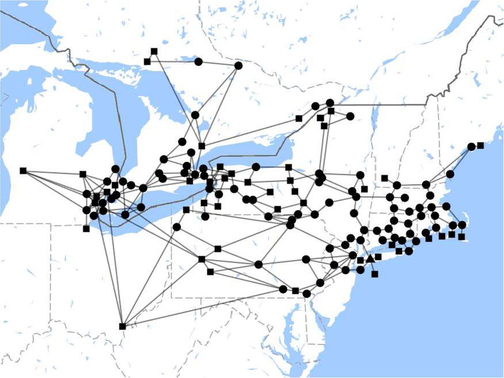

# NY-Simple-Net
NY Simple Net is a simplified power network model for renewable integration studies in New York State.

## NPCC 140-bus model
The NPCC 140-bus model was originally created by Prof. Joe H. Chow at RPI in the 90s.

## Data

### Generator data
1. 2019_NYCA_Generators.xlsx
   A list of existing generating facility from NYISO's 2019 Gold Book.
   - 2019 all: Original data from NYISO's 2019 Gold Book.
   - 2019 thermal: A subset of thermal generators.
   - 2019 thermal matched: A subset of thermal generators that are matched in the RGGI database.
   - 2019 thermal not matched: A subset of thermal generators that are not matched in the RGGI database. Generators with capacity below 25 MW are usually not included in the RGGI database.
   - 2019 thermal NJ: A subset of thermal generators in NJ that are included in NYCA.
   - 2019 nuclear: A subset of nuclear generators.
   - 2019 renewable: A subset of renewable generators.

2. EPA_RGGI/2019/emission_2019XX.csv
   Regional Greenhouse Gas Initiative (RGGI) dataset provides hourly time series data of thermal generators' generation and emission in northeastern US. The data was downloaded from US EPA's [Air Market Program Data](https://ampd.epa.gov/ampd/). The data was used to calculate generator parameters, like maximum output, minimum output, maximum ramp rate, etc.

3. RGGI_2_NYCA_2019.xlsx
   A reference table between the RGGI dataset to NYISO's generator list. It used for matching generators in the RGGI database with the generatos in NYISO's database. Only thermal generators are included in the RGGI database. Thermal generators with capacity below 25 MW are usually not included.

### 
